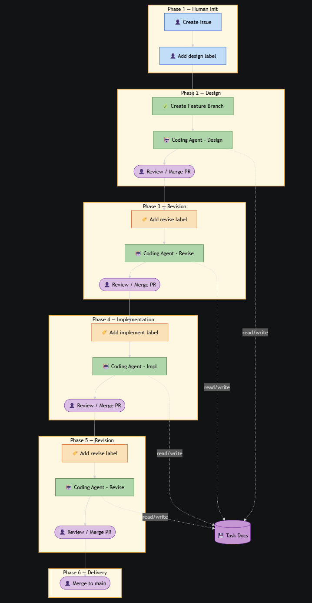

# GitHub Copilot CLI Agent Workflow

An automated AI coding agent workflow powered by GitHub Copilot CLI and GitHub Actions. Issues go through a four-stage workflow — design, design revision, implementation, and implementation revision — each orchestrated by label-triggered workflows and automatically advanced by a stage-router.

## Key Benefits

- Fully automated four-stage workflow: design → design revision → implementation → implementation revision
- Spec-driven development — Copilot produces a detailed design document for each task before writing any code
- Every design and implementation goes through a second-pass review and revision
- Each stage has a customizable agent instruction file (`.agent.md`)
- Each stage can use a different model, balancing cost and quality
- Leverages GitHub Copilot CLI to execute each stage
- Human in the loop — every stage output is reviewed and approved via PR before proceeding
- Each issue is developed on an isolated feature branch, keeping main stable
- Open architecture — stages can be added, removed, or reconfigured as needed, and even works with other CLI based agents.
- GitHub Mobile friendly — just add a label or merge a PR

## How It Works

### Stage Workflow

When an issue is labeled, the corresponding workflow fires and runs Copilot CLI. After Copilot CLI finishes the work, GitHub Actions opens a PR. After the PR is merged, the **stage-router** automatically labels the issue with the next stage.



| Stage | Label | Model | Description |
|---|---|---|---|
| Design | `ai-design` | gpt-5.4 | Analyze issue requirements, produce `docs/tasks/<issue-number>/task.md` |
| Design Revise | `ai-design-revise` | claude-opus-4.6 | Review and revise `task.md` |
| Implement | `ai-implement` | claude-opus-4.6 | Implement code per `task.md`, save summary to `implement.md` |
| Implement Revise | `ai-implement-revise` | gpt-5.4 | Review implementation, make targeted revisions |

### Branch Strategy

Each issue gets a shared base branch plus per-stage branches:

```text
feature/<N>                  ← base branch (created by design stage)
  ├─ feature/<N>-design           → PR into feature/<N>
  ├─ feature/<N>-design-revise    → PR into feature/<N>
  ├─ feature/<N>-implement        → PR into feature/<N>
  └─ feature/<N>-implement-revise → PR into feature/<N>
```

After all four stages complete, merge `feature/<N>` into `main`.

## Setup

### Prerequisites

- A GitHub repository with GitHub Actions enabled
- A GitHub Personal Access Token (PAT) with `repo` scope and Copilot access

### Required Secret

| Secret | Usage |
| --- | --- |
| `COPILOT_ACTION_TOKEN` | Copilot CLI authentication + GitHub API operations |

Add it in **Settings → Secrets and variables → Actions**.

### Required Labels

Create these labels in your repository:

- `ai-design`
- `ai-design-revise`
- `ai-implement`
- `ai-implement-revise`

## How to Start

1. The `docs/` folder contains sample docs for a trip planner app. Create your own `requirements.md`, `design.md`, and `tasks.md` for your project.
2. Create issues based on the tasks in `tasks.md`, one issue per task.
3. Modify `AGENTS.md` to update the coding guidelines if needed.
4. Add the `ai-design` label to an issue to kick off the workflow.
5. Review and merge the PR for each stage — the stage-router advances automatically.
6. After all four stages complete, merge the `feature/<N>` branch into `main`.
